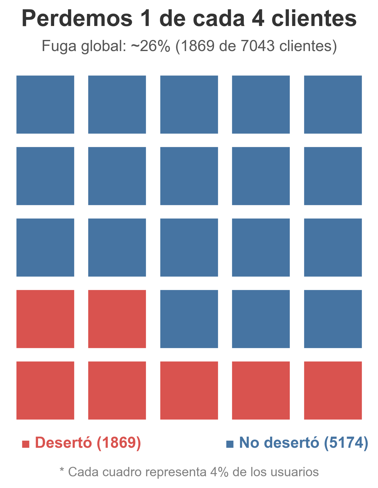
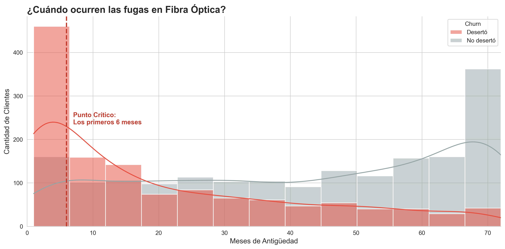
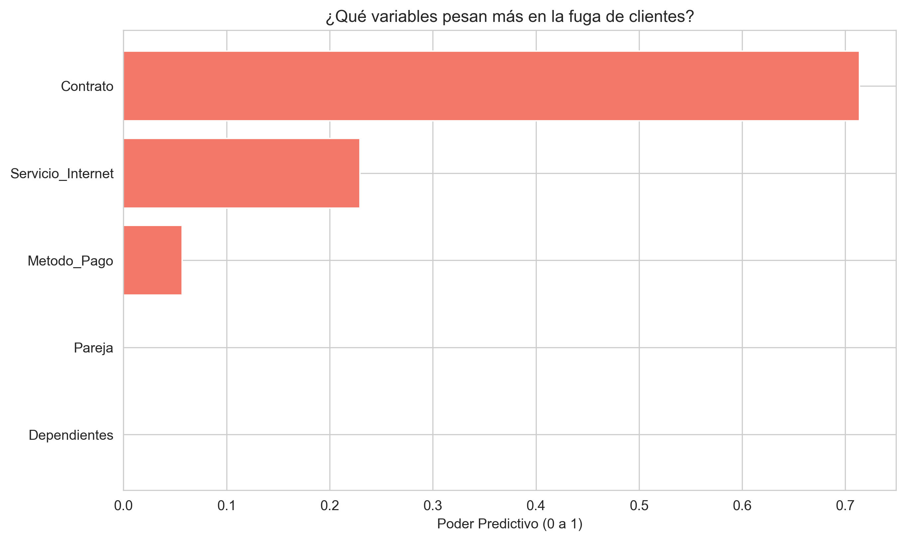
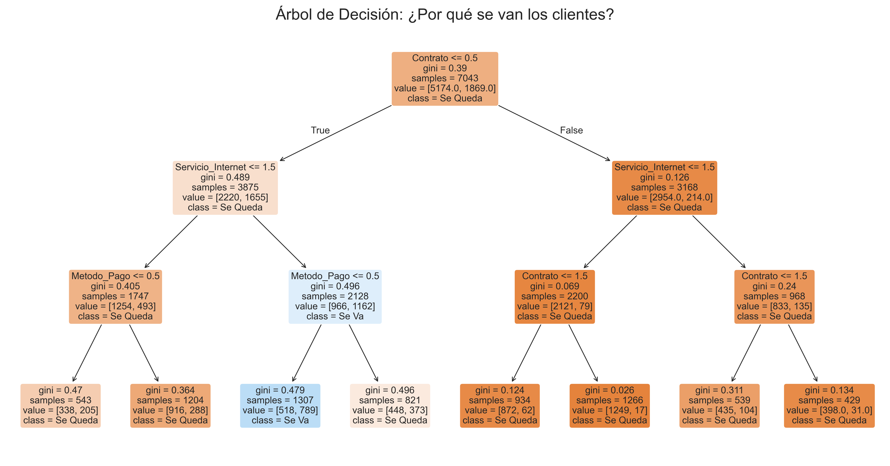

# 📡 Telecom X Latam: Customer Churn Analysis

## 📋 Executive Summary
This project delivers an end-to-end **Exploratory Data Analysis (EDA)** and predictive assessment for a telecommunications provider. By analyzing behavior patterns, I diagnosed the root causes of a **26.6% global churn rate** and developed data-driven strategies to recover potential revenue losses.

> **Context:** Developed as part of the **Oracle Next Education (ONE)** specialization in Data Science & Analytics.

---

## 🔍 Key Strategic Findings

### 1. The "Critical Semester" (53% Risk) 📉
Tenure analysis reveals a massive drop-off early in the customer lifecycle. **53.3% of all churn** occurs within the **first 6 months** of service.
* **Insight:** If a customer survives the first semester, their retention probability increases by over 40%.
* **Strategy:** Implement a "First 180 Days" loyalty program for new users.

### 2. Contract Stability 📄
Statistical analysis confirms that **Month-to-Month** contracts are the primary volatility factor. Transitioning users to 1-year plans drastically reduces exit probability.

### 3. The "Churn Profile" (Decision Tree) 🌳
Using a Decision Tree Classifier, we mapped the specific high-risk profile:
`Month-to-Month Contract` + `Fiber Optic` + `Electronic Check Payment`.

---

## 📊 Visual Analysis Gallery

### 1. The Scale of the Problem

> **Insight:** We are currently losing **1 in 4 customers** (~26%). This visualizes the immediate impact on revenue stability.

---

### 2. The "6-Month Cliff" (Critical Insight)

> **Insight:** The red dotted line marks the danger zone. **53.3% of churn events** happen within the first half-year. If we retain a user past month 6, their lifetime value increases significantly.

---

### 3. What Drives the Exit? (Mathematical Proof)

> **Insight:** Unlike common intuition, demographics (Gender, Partner) matter very little. The **Contract Type** and **Internet Service** technical specs are the true drivers of dissatisfaction.

---

### 4. The Path to Churn (Decision Rules)

> **Insight:** A specific "Toxic Combo" was identified: Customers with a **Month-to-Month contract**, using **Fiber Optic**, and paying via **Electronic Check** have the highest probability of leaving.

---

## 🛠️ Technical Workflow
This project simulates a real-world Data Analysis task:
1.  **ETL & Cleaning:** Transformed raw JSON data, handled missing values, and encoded categorical features for ML compatibility.
2.  **Feature Engineering:** Validated variable importance using Correlation Matrices and Random Forest feature ranking.
3.  **Modeling:** Implemented a Decision Tree Classifier to extract human-readable business rules for the marketing team.

---

## 👤 About the Author
**Kevin Mendoza**
* 🧪 **Biotechnology Engineer** 
* ⚙️ **Data Engineer in Training:** Transitioning into scalable data infrastructure.
